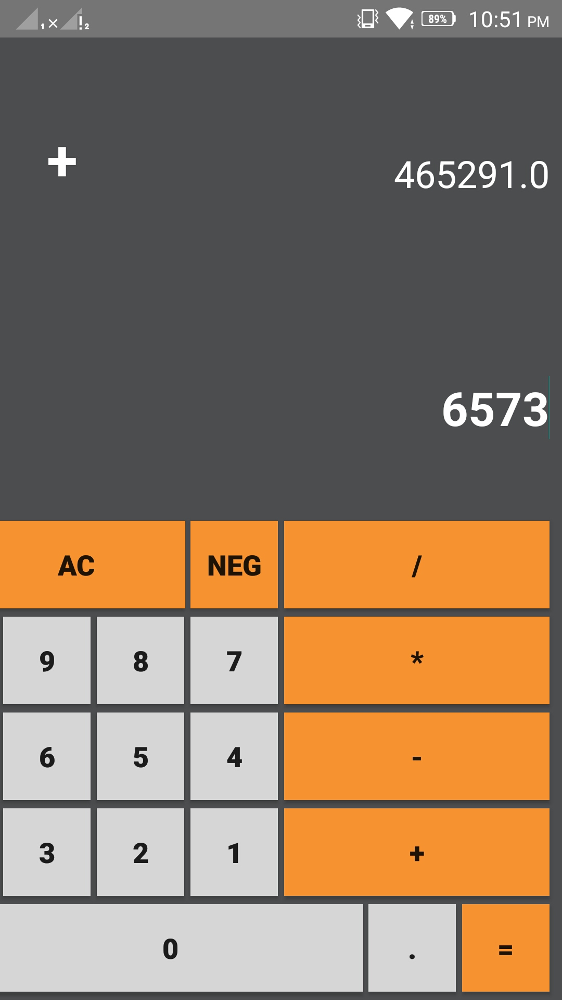
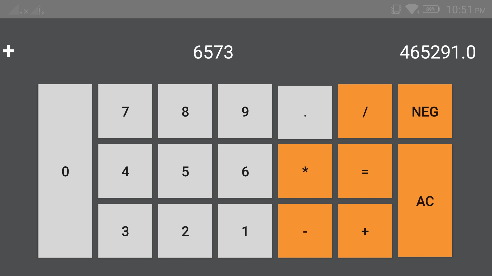

# Android-Calculator
This android application is a basic calculator that perform mathematical operations.

# Version Support
This app will work on Android version 4.4.2 (Android Kitkat) or above.

# Features
The application works in both portrait and landscape mode.
The application scale itself automatically depending upon the device size. 

# Screenshots

